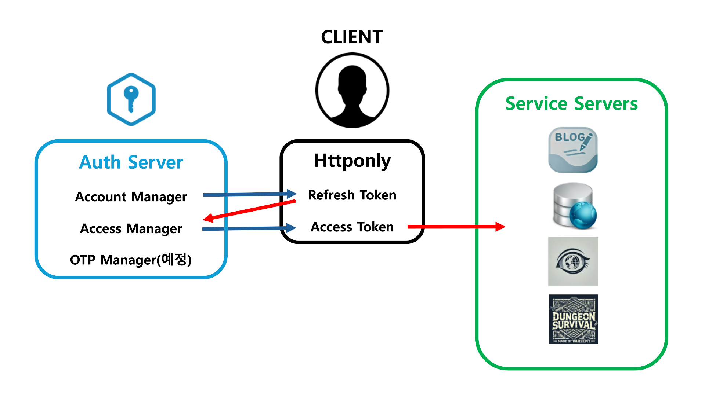
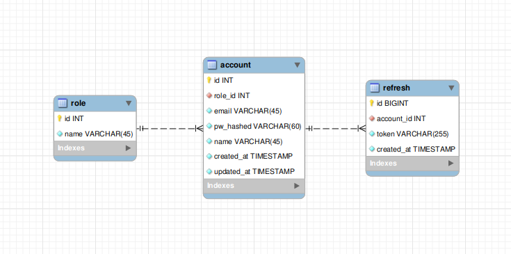

# authorization_server_py

## 개요
> 마이크로서비스 아키텍쳐의 중앙인증서버 by Python
* 1 단계 : Account Manager 구현
    1. 전체 도메인에서 사용할 계정 구현
    2. 회원가입 및 로그인 관리 구현
* 2 단계 : Access Manager 구현
    1. Refresh & Access 토큰 구현
    2. CSRF 토큰 구현
* 3 단계 : OTP 구현
    1. 스마트폰 앱 구현

## 개발의의
* 복수의 서비스들에서 통일된 Access 제어 가능
* 종합적인 백앤드 실력 향상

## 구조

## 환경
* 도메인 관리 : GoDaddy
* 배포 : AWS(t2.micro)
* OS : Ubuntu 24.04
* 리버스 프로시 : Nginx
* 격리환경 : Docker
* 프레임워크 : Fastapi
* DB : MySQL

## 상태
* 진행 : 2단계 완료
* 기간 : 2024.10.20-
* 인원 : 1명
    * [varzney(최화)](https://varzeny.com/aboutme)
        * 담당 : 전부
        * 기간 : 전부
